# Домашнее задание отчет:

## 1:
**Формулировка задания:** Продолжите Flask-приложение первой пары в отдельном репозитории: добавьте постоянные заметки в PostgreSQL и счётчик в Redis. Опишите приложение, входной сервис Nginx, БД и кеш в `compose.yaml`, запустите стек на своей Linux-ВМ. Закрепите зависимости приложения, отделите установку зависимостей от копирования кода. Добавьте healthcheck БД и кеша и настройте ожидание app через `depends_on` с `condition: service_healthy`. Подтвердите готовность выводом `docker compose ps` и запросом к приложению.

**Результат:**
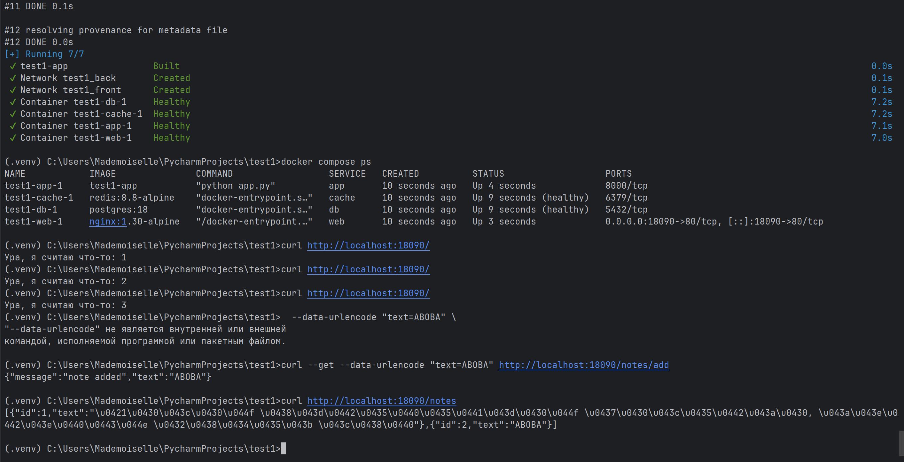

## 2:
**Формулировка задания:** Подключите к БД именованный volume по пути, соответствующему выбранной версии образа. Запишите контрольную заметку, замените контейнер БД с подключением прежнего тома и запросом SQL или через приложение подтвердите её сохранность. Счётчик Redis может быть временным: явно опишите, какое состояние сохраняете, а какое допускаете потерять.

**Результат:**
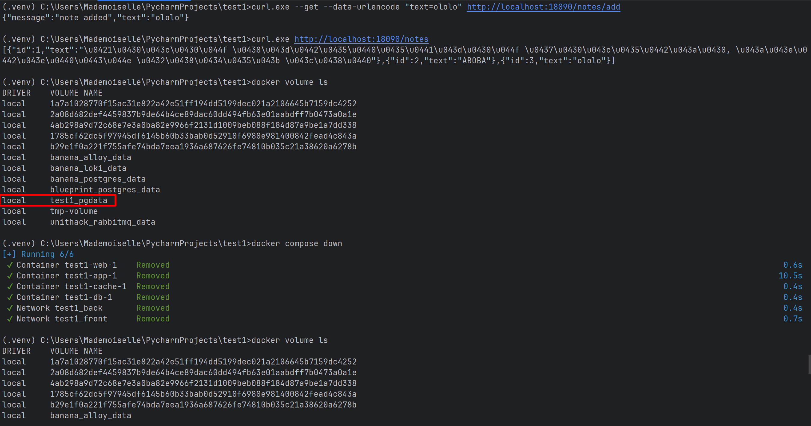
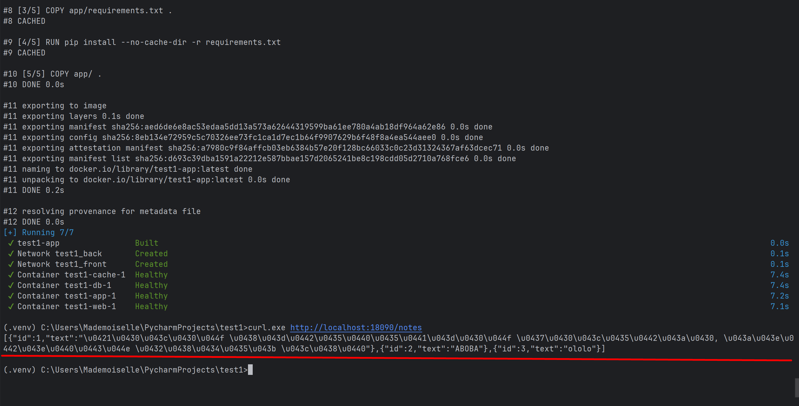

Сохраняем состояние пострес, т.к. там важные заметки, которые хотим помнить и при перезапуске. А счетчик посещений в редисе не то что бы основная информация. Ничего не случиться, если не будем сохранять

## 3:
**Формулировка задания:** Сделайте холодный бэкап БД: остановите все сервисы, которые могут писать в неё, и саму БД, сохранив том обычным `docker compose down` без `-v`. Через временный контейнер создайте архив содержимого тома в каталоге вне исходного volume. После успешного создания архива удалите только том собственного учебного проекта, создайте его заново и восстановите архив. Поднимите тот же стек с тем же образом БД и подтвердите контрольную заметку запросом. В отчёте приложите команды остановки, архивирования, удаления, восстановления и ключевой вывод проверки. Создание архива без проверки восстановления не считается завершённой частью задания.

**Результат:**
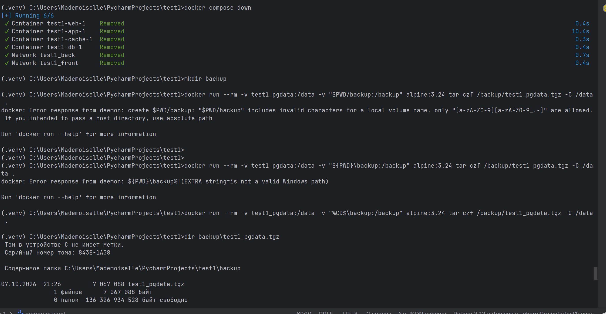
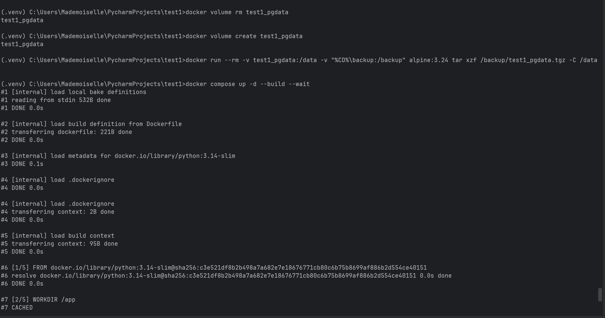
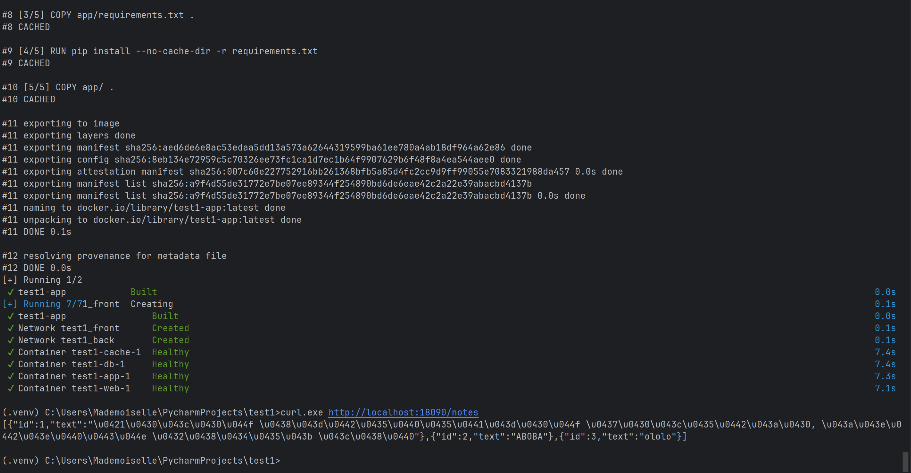

## 4:
**Формулировка задания:** Разделите стек минимум на две пользовательские сети: front для Nginx и Flask, back для Flask, БД и кеша. Публикуйте только входной сервис. Из Nginx проверьте отсутствие DNS-имени БД и отказ прямого TCP-подключения к её внутреннему IP и порту; из приложения подтвердите успешный доступ к БД и кешу. Не подключайте входной сервис к back ради прохождения проверки. Объясните, почему Flask в двух сетях выполняет свои запросы к БД, но не становится автоматическим IP-маршрутизатором.

**Результат:**
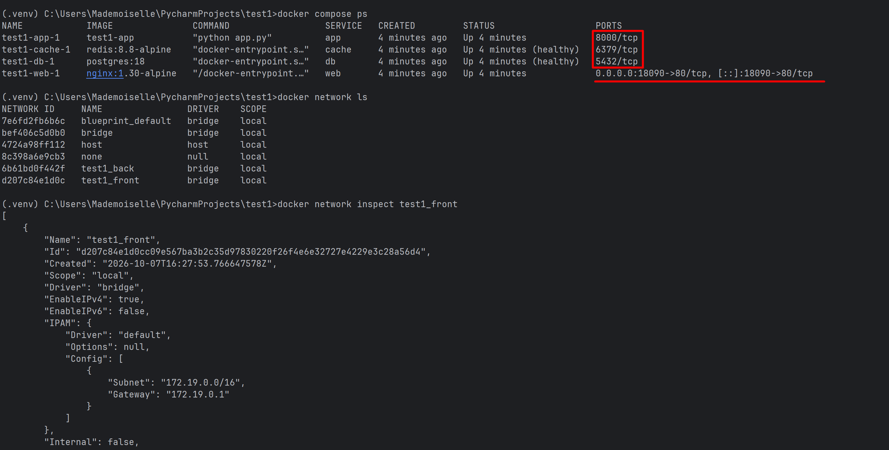
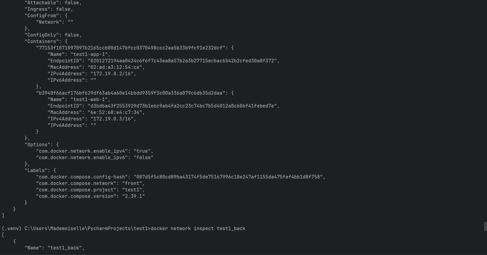
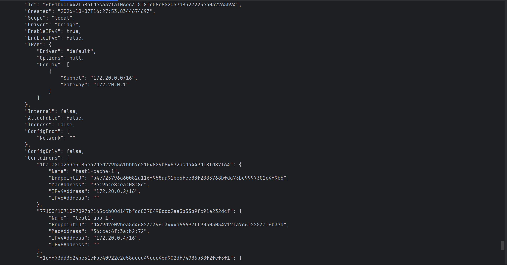
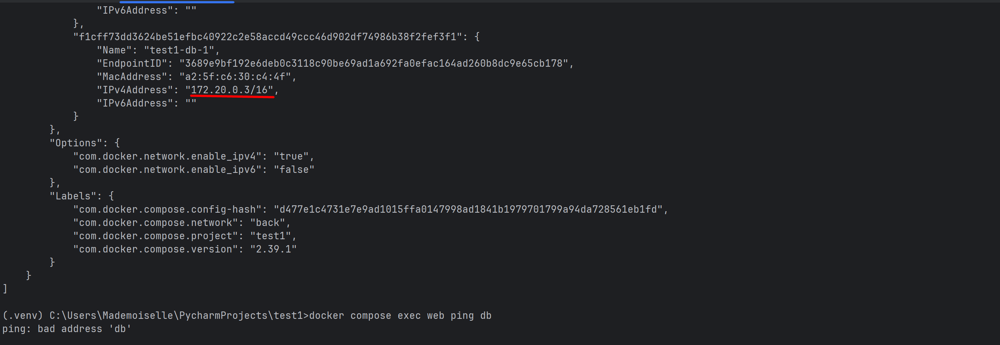
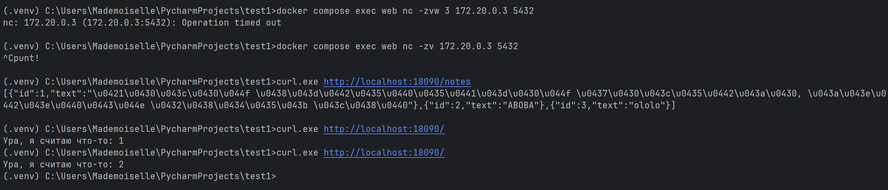 через ручки смотрим, что типо спокойно Flask -> PostgreSQL и Flask -> Redis
Flask подключен и к front и к back сетям. В связи с этим он может принимать запросы от Nginx (через front) и обращаться к PostgreSQL и Redis (через back).
Flask не является IP-маршрутизатором, т.к. наличие двух сетей не включает пересылку пакетов между ними. Это настраивается отдельно какими-то страшными командами.

## 5:
**Формулировка задания:** Вынесите изменяемые значения в переменные. Добавьте в Git `.env.example` с безопасными примерными значениями и исключите рабочую `.env` через `.gitignore`. Покажите итог `docker compose config`, удалив реальные секреты из отчётного вывода. Объясните источник имени проекта, его приоритет и имена контейнеров, сетей и томов. Покажите различие `down` и `down -v` только на данных собственного стенда, которые можно восстановить.

**Результат:**

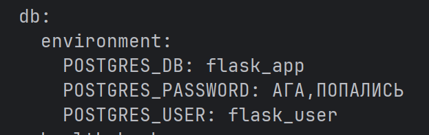

Имя проекта просто по директории берется (по умолчанию так). Имя проекта можно явно задать через -p. Потом по приоритету можно переменной окружения COMPOSE_PROJECT_NAME. Дальше можно name в конфигурации указать и потом уже по директории.
имена контейнеров: имя проекта-имя сервиса-номер экземпляра(если есть)
имена сетей задаем в конфигурации + получаем префикс с именем проекта, volume аналогично
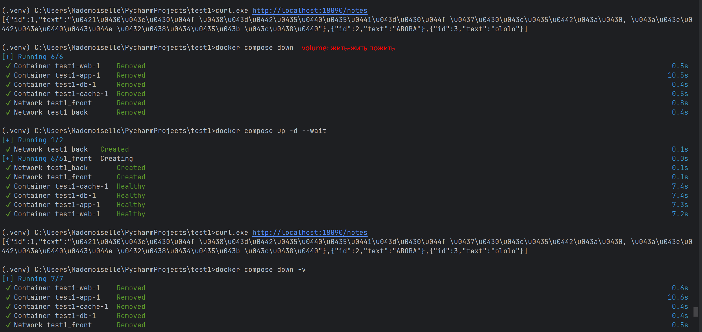
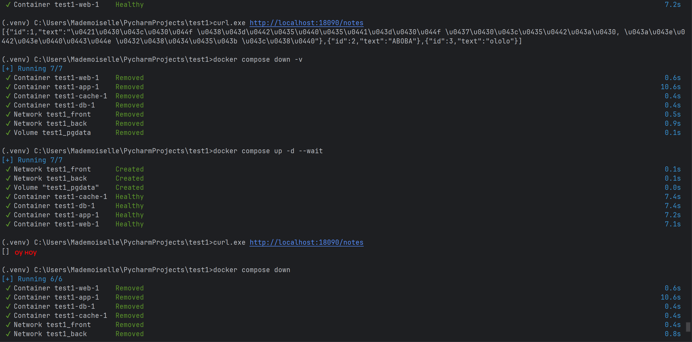
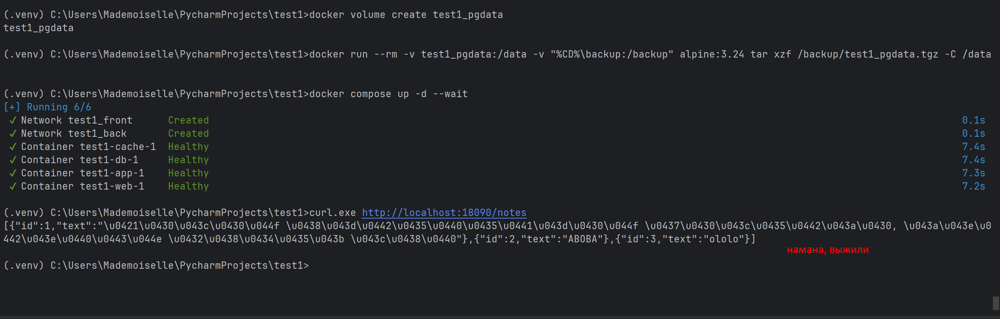

## 6:
**Формулировка задания:** Откройте образ приложения в dive до и после осмысленной оптимизации Dockerfile. Приложите оба размера, метрики и результат dive; объясните, какие слои или файлы изменились и почему поведение приложения сохранилось. Не приравнивайте PASS к минимальному размеру образа. В отчёте используйте собственный вывод и укажите версии инструментов.

**Результат:**
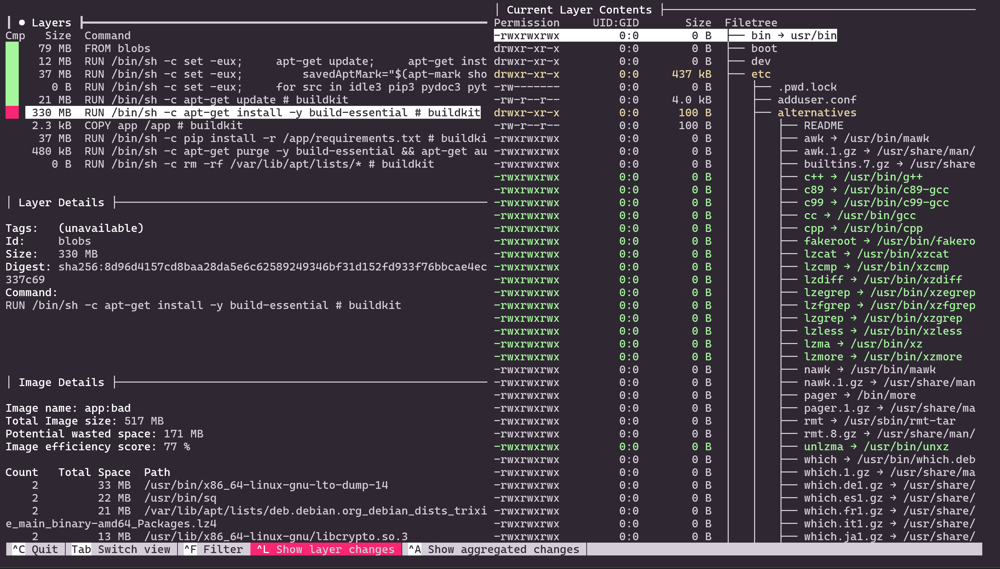 ну тут ваще плохо. Какие-то непонятные команды, все в разных строчках, 0 оптимизации
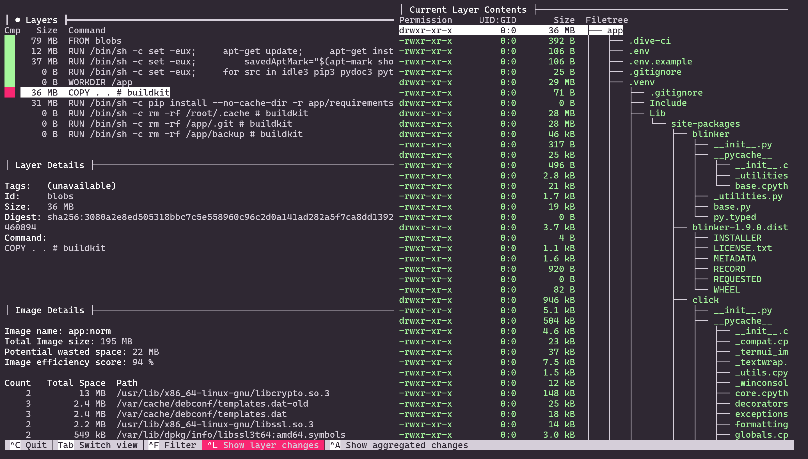 уже неплохо, видим хороший прцоент, но размер хочется поменьше, еще и видим, что все меняется в слое
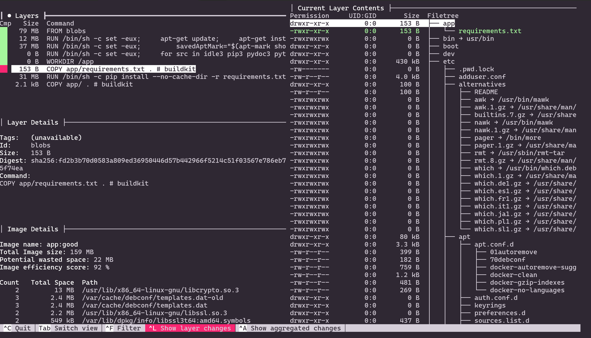 другое дело, все оптимально, без лишних копирований с переиспользованием кеша, сказка

## 7:
**Формулировка задания:** Со звёздочкой: добавьте `compose.override.yaml` или `develop.watch`, чтобы изменение кода применялось автоматически. Объясните базовую и объединённую конфигурацию, а для watch покажите фактическое событие sync/rebuild, не только запуск наблюдения. Ещё одно независимое задание со звёздочкой: добавьте в GitHub Actions `CI=true dive` с осмысленными порогами. Проверка должна возвращать ошибку job при нарушении порога; демонстрационный `|| true` для этого не подходит.

**Результат:**
(не сегодня, соре)

## 8:
**Формулировка задания:** Сдайте репозиторий с исходниками, Dockerfile, compose-файлами и `.env.example`, а также короткий отчёт с командами, контрольными строками и объяснениями. Не присылайте токены, пароли рабочей среды, `.env` или полный дамп личных данных. В конце очистите только ресурсы своего проекта.

**Результат:**
Перед вашими глазами :)